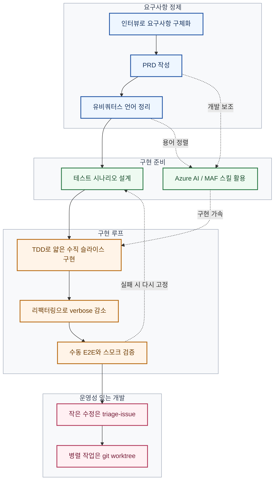

# homestyle-rag

[](https://github.com/HakjunMIN/maf-boilerplate/actions/workflows/ci.yml)
-yellowgreen)
[](https://github.com/HakjunMIN/maf-boilerplate/actions/workflows/pytest.yml)

[](https://github.com/HakjunMIN/maf-boilerplate/actions/workflows/ruff.yml)
[](https://github.com/HakjunMIN/maf-boilerplate/actions/workflows/mypy.yml)

LG 홈스타일 공개 콘텐츠를 수집하고, Azure AI Search와 Microsoft Agent Framework를 이용해 근거 기반 한국어 응답을 제공하는 실험용 RAG 하네스다. 이 저장소는 기능 데모보다 소프트웨어 엔지니어링 기본기에 충실한 개발 하네스를 만드는 데 더 큰 비중을 두었다.


## 이 저장소가 강조하는 것

- 인터뷰로 요구사항을 구체화한다.
- PRD를 먼저 만들고 범위를 고정한다.
- 유비쿼터스 언어를 정리해 용어 충돌을 줄인다.
- `application` / `domain` / `infrastructure`를 분리해 DDD 개념을 구조에 반영한다.
- TDD로 얇은 수직 슬라이스를 구현하며 verbose한 코딩을 줄인다.
- 작은 수정은 `triage-issue` 흐름으로 빠르게 다룬다.
- 병렬로 진행 가능한 작업은 `git worktree` 기반으로 분리한다.
- Azure AI와 Microsoft Agent Framework 관련 스킬을 적극 활용해 구현과 검증 속도를 높인다.

## 개발 방식

이 프로젝트의 개발 과정은 인터뷰를 통해 요구사항을 정밀화하고, 그 결과를 PRD와 유비쿼터스 언어로 고정한 뒤, 테스트를 먼저 세우고 구현을 얇게 전개하는 방식으로 진행했다. 저장소는 스펙을 단일 진실 공급원으로 삼는 개방형 운영 모델은 아니다. 즉, 스펙 문서는 중요한 경계이지만 코드, 테스트, 운영 판단이 함께 현실의 진실을 구성한다.

## 개발 라이프사이클



## 구현 범위

현재 저장소는 다음 두 축으로 구성된다.

1. LG 홈스타일 공개 웹 페이지를 대상으로 한 크롤링 및 인덱싱 파이프라인
2. 검색 결과를 근거로만 답변하는 Microsoft Agent Framework 기반 QA 런타임

크롤링 구현 내용은 별도 문서로 정리했다.

- [구현된 크롤링 프로젝트 문서](./docs/crawling-project.md)

## 핵심 산출물

- [PRD.md](./PRD.md): 문제 정의, 운영 경계, 인덱싱/에이전트 결정 사항
- [UBIQUITOUS_LANGUAGE.md](./UBIQUITOUS_LANGUAGE.md): 팀 내 용어를 고정한 문서
- [docs/lsp-agentic-coding.md](./docs/lsp-agentic-coding.md): Python LSP 기반 코드 탐색과 에이전틱 코딩 운영 방식
- [scripts/README.md](./scripts/README.md): 수동 E2E 검증 스크립트 설명

## 저장소 구조

```text
src/
  homestyle_ingestion/
    application/      # discovery, ingestion, extraction orchestration
    domain/           # crawling, extraction, review queue 도메인 모델
    infrastructure/   # fetch, rendering, indexing, storage 구현
  homestyle_agent/
    application/      # grounded query orchestration
    infrastructure/   # Microsoft Agent Framework 런타임 및 retrieval 연결
  homestyle_shared/
    infrastructure/   # Azure Identity, OpenAI, observability, settings
tests/
  application/        # 유스케이스/파이프라인 테스트
  infrastructure/     # 외부 경계 어댑터 테스트
  e2e/                # HTTP API 수동 E2E 검증용 요청 세트
config/
  discovery.toml      # 크롤 대상 설정
```

이 구조는 단순한 폴더 분리가 아니라 DDD 개념을 코드 수준에 반영하려는 의도를 담고 있다. 도메인 규칙은 `domain`에, 유스케이스 조합은 `application`에, Azure/Playwright/Search 같은 외부 기술 의존성은 `infrastructure`에 두어 변경의 locality를 높이려 했다.

## 사용한 스킬과 도구

- `to-prd`: 인터뷰 결과를 PRD로 정리하는 시작점
- `ubiquitous-language`: 도메인 용어를 팀 공용 언어로 고정
- `improve-codebase-architecture`: DDD 개념이 드러나는 seam과 모듈 경계를 더 분명하게 다듬는 데 참고
- `tdd`: 테스트 우선 흐름 유지
- `triage-issue`: 단순 수정과 문제 분류를 빠르게 처리
- `using-git-worktrees`: 병렬 개발 분리
- `azure-ai`: Azure OpenAI, Azure AI Search 관련 구현 판단 지원
- `microsoft-agent-framework`: Agent Framework 기반 런타임 구현 지원

아키텍처 결정 기록을 더 명시적으로 남기기 위해 Architecture Decision Record 기반 스킬 도입도 검토 중이다. 다만 현재 저장소는 ADR을 단일 필수 흐름으로 강제하지는 않고, PRD와 유비쿼터스 언어 중심의 작업 방식을 우선하고 있다.

## 빠른 시작

```bash
uv sync --group dev
uv run playwright install chromium
uv run pytest
```

## 홈스타일 에이전트 HTTP API

필수 환경 변수 이름은 아래와 같다. 실제 토큰, 키, 커넥션 스트링 값은 저장소에 기록하지 않는다.
서버는 저장소 루트의 `.env`를 자동으로 읽고, 같은 이름의 프로세스 환경 변수가 있으면 그 값을 우선한다.

```bash
AZURE_OPENAI_ENDPOINT
AZURE_OPENAI_API_VERSION
AZURE_OPENAI_CHAT_DEPLOYMENT
AZURE_OPENAI_EMBEDDING_DEPLOYMENT
AZURE_OPENAI_VISION_DEPLOYMENT
AZURE_SEARCH_ENDPOINT
AZURE_SEARCH_INDEX_NAME
HOMESTYLE_AGENT_BEARER_TOKEN
```

로컬 개발에서 `Token tenant ... does not match resource tenant` 오류가 나면 Azure CLI가 다른 tenant로 로그인된 상태다. Azure OpenAI 리소스가 속한 tenant로 `az login --tenant <tenant-id>`를 다시 수행하거나, 루트 `.env`에 `AZURE_TENANT_ID=<tenant-id>`를 지정한다.
Azure AI Search RBAC 권한이 없고 로컬 `.env`에 `AZURE_SEARCH_ADMIN_KEY`가 있으면 서버는 Search 요청에만 해당 키를 사용한다.

로컬 실행:

```bash
PYTHONPATH=src uv run python -m homestyle_agent.api.server
```

질문 요청:

```bash
curl -X POST http://127.0.0.1:8080/ask \
  -H "Authorization: Bearer $HOMESTYLE_AGENT_BEARER_TOKEN" \
  -H "Content-Type: application/json" \
  -d '{"question":"거실 스타일링을 알려줘"}'
```

질문 세트 기반 E2E curl 검증:

```bash
jq -c '.questions[]' tests/e2e/observability_questions.json | while IFS= read -r item; do
  id=$(printf '%s' "$item" | jq -r '.id')
  question=$(printf '%s' "$item" | jq -r '.question')
  body=$(jq -nc --arg question "$question" '{question: $question}')
  response=$(curl -sS --connect-timeout 5 --max-time 90 -w '\n%{http_code}' \
    -X POST http://127.0.0.1:8080/ask \
    -H "Authorization: Bearer $HOMESTYLE_AGENT_BEARER_TOKEN" \
    -H "Content-Type: application/json" \
    -d "$body")
  http_status=${response##*$'\n'}
  response_body=${response%$'\n'*}
  summary=$(printf '%s' "$response_body" | jq -r '.answer // .detail // .title // .' 2>/dev/null | tr '\n' ' ' | cut -c1-180)
  printf '[%s] HTTP %s %s\n  %s\n' "$id" "$http_status" "$question" "$summary"
done
```

HTTP API 대신 런타임 클래스를 직접 호출하려면 아래처럼 사용할 수 있다.

```python
import asyncio

from homestyle_agent import AzureRagRuntime
from homestyle_shared.infrastructure.settings import AzureRagSettings, load_environment


async def main() -> None:
  settings = AzureRagSettings.from_env(load_environment())
  runtime = AzureRagRuntime(settings)
  try:
    answer = await runtime.answer("거실 스타일링을 알려줘")
    print(answer)
  finally:
    await runtime.close()


if __name__ == "__main__":
  asyncio.run(main())
```

## 현재 프로젝트 원칙

- 공개 HTML만 수집한다.
- 한국어(`ko`) 범위를 우선한다.
- 검색과 응답은 근거 중심으로 제한한다.
- 근거가 없으면 모른다고 답한다.
- 구현 변경은 가능한 한 테스트로 먼저 고정한다.
- 과한 추상화보다 명시적인 구조를 우선한다.
